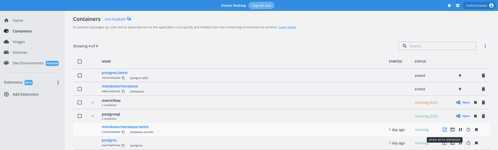
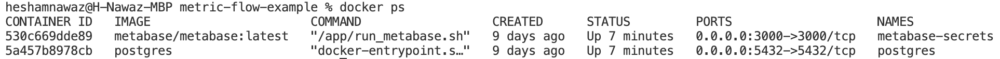
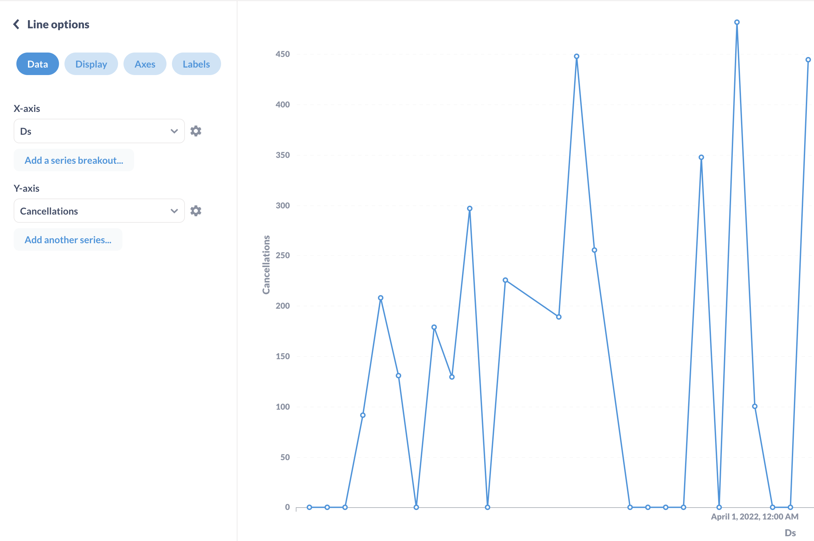
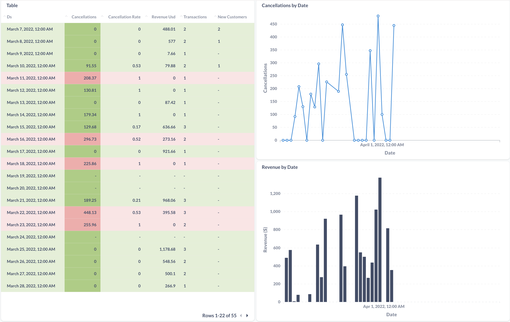

# MetricFlow Example Repo

This repository provides an example of an end-to-end deployment of MetricFlow. The example repo uses the following tools:

* [Docker](https://www.docker.com/products/docker-desktop/)
* [MetricFlow](https://github.com/transform-data/metricflow)
* [PostgreSQL](https://www.postgresql.org/download/)
* [Python 3.9](https://www.python.org/downloads/)
* [Metabase](https://www.metabase.com/docs/latest/operations-guide/running-metabase-on-docker.html)

You will need to install Docker and Python to follow this guide.

## Installation

Download this repository and use the package manager [pip](https://pip.pypa.io/en/stable/) to install metricflow.

```bash
pip install metricflow
```

Open the Docker Desktop application and provide all relevant permissions. Once Docker is running, navigate to the following directory
```bash
cd metricflow-example/metricflow/local-data-warehouses/postgresql
```
and then run
```bash
docker-compose up
```
This will spin up the PostgreSQL and Metabase containers.

To initialize MetricFlow, open another terminal window and run 
```bash
mf setup
```

Enter 'postgresql' as your data warehouse dialect when prompted. 

A template file will be created. If you've run this before, it will say "a template config already exists in \<location>". If it already exists, replace that file with the config file below.

To create the sample_models directory, run 
```bash
mf tutorial
```

Navigate to the config.yml file in the .metricflow directory created earlier and fill it out with the following, changing the username to the corresponding one for your system.
```yml
dwh_schema: 'transform'
model_path: /Users/{username}/.metricflow/sample_models  # Path to directory containing defined models (Leave until after DWH setup). Specify the username for your system
email: ''  # Optional
dwh_dialect: postgresql
dwh_host: '127.0.0.1'  # Host name
dwh_port: '5432'
dwh_user: 'metricflow'  # Username for the data warehouse
dwh_password: 'metricflowing'  # Password associated with the provided user
dwh_database: 'metricflow'
```

## Creating a Materialization

MetricFlow supports PostgreSQL which means you can use it without having to set up a connection to your own data warehouse. We can access the sample data that's loaded in the tutorial by creating a materialization. 

More information about materializations in MetricFlow can be found [here](https://docs.transform.co/docs/metricflow/reference/materializations/#what-are-materializations-in-metricflow).

To create the materialization, navigate to the model_path specified in the previous step and save [this file](materialization.yaml) to that location. You can also create the materialization.yaml file manually and fill it out with the following:
```yml
materialization:
  name: example_materialization # name your materialization. this will be the table name written in your data warehouse.
  description: test description # add an optional description.
  metrics: # list all the metrics you want to materialize in your materialization. all metrics must be defined in your model.
    - cancellations
    - cancellation_rate
    - revenue_usd
    - cancellations_mx
    - transaction_usd_na
    - transaction_usd_l7d_mx
    - transaction_usd_mtd
    - transaction_usd_na_l7d
    - transaction_amount_usd
    - transactions
    - quick_buy_amount_usd
    - new_customers

  dimensions: # list all corresponding dimensions you want to include for these metrics. these must all be defined in your data sources. these dimensions must be shared across all metrics in your materialization.
    - ds

  destination_table: transform.example_materialization # The materialization will be written to this destination.

# Optional destinations:
# Materializations always write to the datawarehouse. You can specify additional optional destinations. Check the documentation for a complete list of destinations.
  destinations:
    - location: DW
      format: WIDE

 ```

Then, run
```
mf materialize --materialization-name example_materialization
```

You can continue without specifying a start_time.

To verify that the materialization was created successfully, run 
```
mf list-materializations
``` 


## Using MetricFlow with Metabase
You can navigate to localhost:3000 in your browser to access Metabase.

You can also open it from the Containers section in Docker



You will be prompted to go through the Metabase onboarding flow; once that's compeleted, you can add your data by selecting PostgreSQL and filling out the fields with the following:\
**Display name**: ExampleDB\
**Host**: \<Container ID> 
(Note: to obtain this, run 'docker ps' and copy the Container ID that corresponds to the Postgres image)\
**Port**: 5432\
**Database name**: metricflow\
**Username**: metricflow\
**Password**: metricflowing

All other settings can remain unchanged. Click 'Next' to open Metabase, and then using the Browse data tab on the left, navigate to ExampleDB/transform/Example Materialization.

After you've navigated to the correct table, you can create visualizations using the Visualizations button on the bottom-left. Choose a visualization type from the menu and select the parameters for the visualization.

Once you have created the visualization, you can save it and add it to a dashboard. 


You can also create a new visualization (Question) or dashboard by clicking the 'New' button on the top-right. These additional visualizations can also then be added to the previously created dashboard.




## Using MetricFlow with Python
This repository also contains a [Jupyter Notebook](Python/python_notebook.ipynb) showing how to use the MetricFlow Python API to query metrics and dimensions. 

## Additional Resources
[Metabase tutorial](https://www.metabase.com/learn/getting-started/getting-started.html)